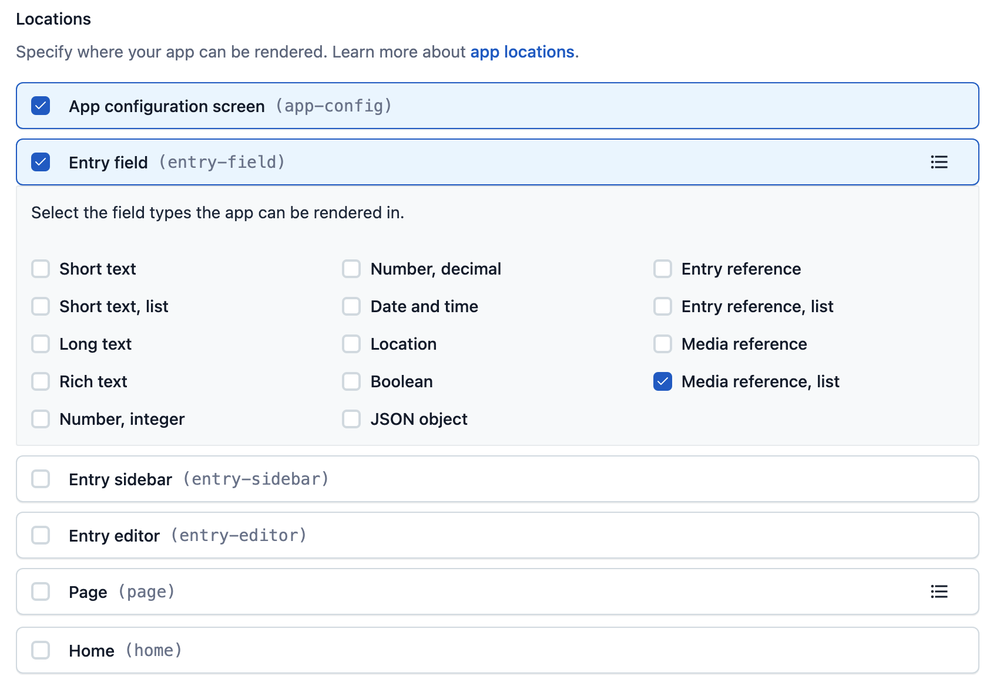
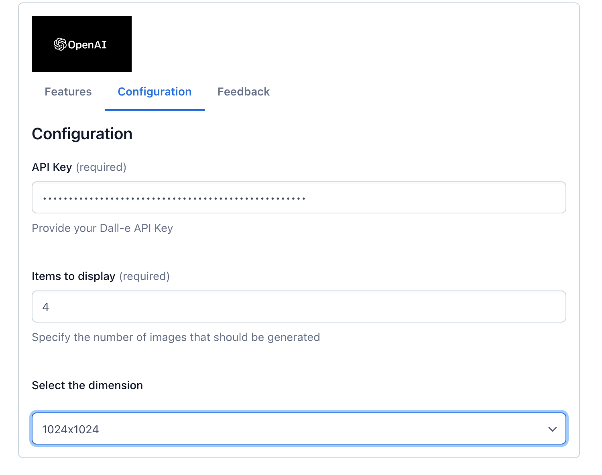
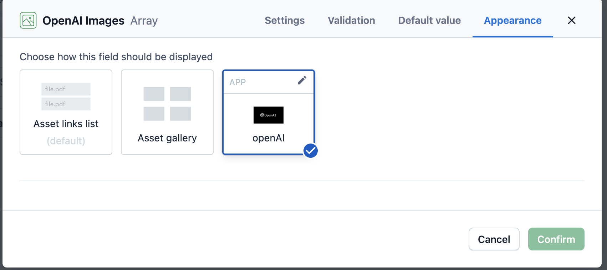

This project was bootstrapped with [Create Contentful App](https://github.com/contentful/create-contentful-app).

This is a POC field level app for the Media Reference field (multi). A user submits a prompt to OpenAI for image generation, which returns the configured number of images and image size to the field. The editor can select one or many images that should be created, decide if they should be published or not, and link the images into the Media Reference field.

# App Definition
The app definition needs to be set up for configuration page, and entry-field (media references, list).
 

# Configuration

The app requires only a few elements to be configured: 

- The OpenAI API key
- How many images should be returned from the API
- The image size (defaults to 1024x1024)

# Field Configuration
Once the app is installed and configured in your space, you need to use the app's media reference entry field.

Please note that the configuration options for the image sizes are the only available dimensions the API accepts.

# Additional Aspects
This app is using [Forma 36](https://f36.contentful.com/) – Contentful's design system, and [Contentful Field Editors](https://www.contentful.com/developers/docs/extensibility/field-editors/) – Contentful's field editor React components to ensure the app continues the look and feel of Contentful, and reuses as much functionality as possible without reinventing the wheel.  
